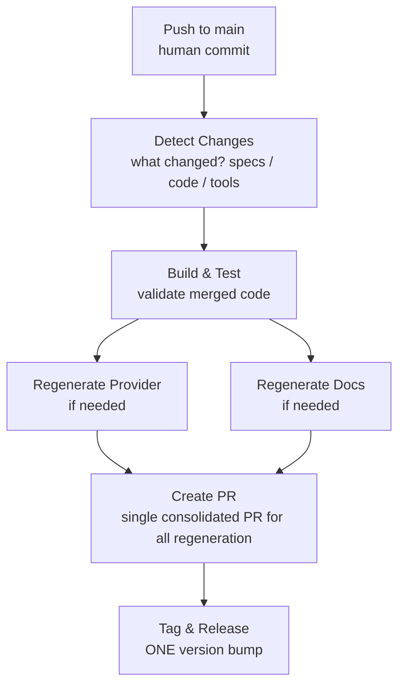

# Development Guide

Community-driven Terraform provider for F5 Distributed Cloud built using the HashiCorp Terraform Plugin Framework. The provider implements public OpenAPI specifications to manage F5 Distributed Cloud resources through declarative Terraform configurations.

## Build & Development Commands

```bash
# Build the provider binary
go build -o terraform-provider-xcsh

# Run all tests
go test ./...

# Run acceptance tests (requires XCSH_API_TOKEN or XCSH_P12_FILE)
TF_ACC=1 go test ./... -v -timeout 120m

# Generate documentation (requires terraform CLI)
go generate ./...

# Install locally for testing
mkdir -p ~/.terraform.d/plugins/registry.terraform.io/f5-sales-demo/xcsh/0.1.0/darwin_arm64
cp terraform-provider-xcsh ~/.terraform.d/plugins/registry.terraform.io/f5-sales-demo/xcsh/0.1.0/darwin_arm64/
```

## Environment Variables

- `XCSH_API_TOKEN` — API token for F5 Distributed Cloud (one of token or P12 required)
- `XCSH_API_URL` — Base API URL for your F5 Distributed Cloud tenant (required, no default)
- `XCSH_P12_FILE` — Path to PKCS#12 certificate file (alternative to token authentication)
- `XCSH_P12_PASSWORD` — Password for PKCS#12 certificate file (required with `XCSH_P12_FILE`)
- `TF_ACC=1` — Enable acceptance test suite execution

## Architecture

### Directory Structure

- `main.go` — Provider entry point with version injection via GoReleaser
- `internal/provider/` — Terraform resource and data source implementations
- `internal/client/` — F5 Distributed Cloud API HTTP client and data type definitions
- `tools/` — Code generation and documentation transformation utilities
- `docs/` — Generated provider documentation for the Terraform Registry
- `examples/` — Terraform example configurations
- `templates/` — Documentation templates processed by `tfplugindocs`

### Resource Implementation Pattern

Each resource follows the Terraform Plugin Framework architecture:

1. **Resource struct** implementing `resource.Resource`, `resource.ResourceWithConfigure`, and `resource.ResourceWithImportState`
2. **Model struct** with `tfsdk` tags for state encoding and decoding
3. **CRUD methods**: `Create`, `Read`, `Update`, and `Delete`
4. **Registration** in `provider.go` using the `Resources()` function

Example reference: `internal/provider/namespace_resource.go`

### Client Architecture

`internal/client/client.go` provides:

- HTTP client wrapper for the F5 Distributed Cloud REST API (`Client` struct)
- Go type definitions for all supported resource schemas
- Standardized CRUD methods: `Create{Resource}`, `Get{Resource}`, `Update{Resource}`, `Delete{Resource}`

API authentication uses a Bearer token header: `Authorization: APIToken {token}` or mTLS certificates.

### Code Generation

The `tools/` directory contains utilities for scaffolding resources from OpenAPI specifications:

- `generate-all-schemas.go` — Generates provider resources, data sources, and client types from domain specifications
- `transform-docs.go` — Enhances generated documentation with metadata, syntax callouts, and cross-references
- `generate-examples.go` — Generates Terraform example configurations

## Generated Files (Never Commit Manually)

| Directory/File | Generated By | Workflow |
| --- | --- | --- |
| `docs/resources/*.md` | `tfplugindocs` + `transform-docs.go` | `on-merge.yml` |
| `docs/data-sources/*.md` | `tfplugindocs` + `transform-docs.go` | `on-merge.yml` |
| `examples/resources/*/*.tf` | `generate-examples.go` | `on-merge.yml` |
| `examples/data-sources/*/*.tf` | `generate-examples.go` | `on-merge.yml` |
| `internal/provider/*_resource.go` | `generate-all-schemas.go` | `on-merge.yml` |
| `internal/provider/*_data_source.go` | `generate-all-schemas.go` | `on-merge.yml` |
| `internal/provider/network_allowlist_manifest_generated.go` | `generate-all-schemas.go` from the pinned OpenAPI extension | `on-merge.yml` |

To fix an issue in generated code or documentation, update the **generator or template**, not the generated file. CI automation blocks pull requests containing manually edited generated files.

## Manually Maintained Files

The following files reside in generated directories but are maintained manually:

| File | Purpose |
| --- | --- |
| `provider-release-surface.json` | Exact public resources, data sources, actions, and functions |

## Workflow Architecture



Reusable workflows (`_build-test.yml`, `_generate-docs.yml`, `_generate-provider.yml`, `_tag-release.yml`) are invoked by the `on-merge.yml` orchestrator.

## API Specifications

Starting with v3.0.0, the provider consumes v2 API specifications organized into domain categories (Security, Networking, Infrastructure, Platform, Operations, AI). The generator automatically detects specification schemas and processes domain files containing multiple resource definitions.

## Release Process

Releases are automated using GoReleaser when pushing a version tag (`v*`):

1. Builds cross-platform binaries
2. Generates cryptographic SHA-256 checksums and GPG signatures
3. Publishes release artifacts and manifests to GitHub Releases for the Terraform Registry

## Key Dependencies

- `github.com/hashicorp/terraform-plugin-framework` — Core Terraform provider SDK
- `github.com/hashicorp/terraform-plugin-log` — Structured logging library
